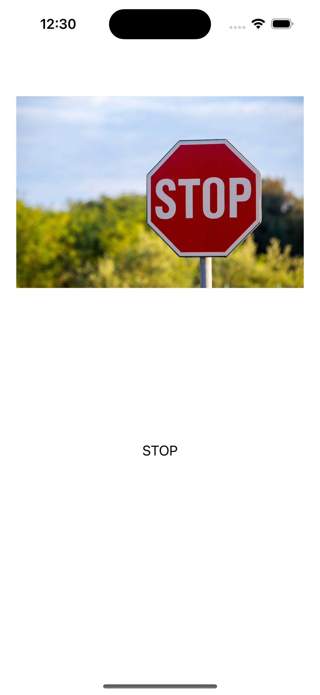
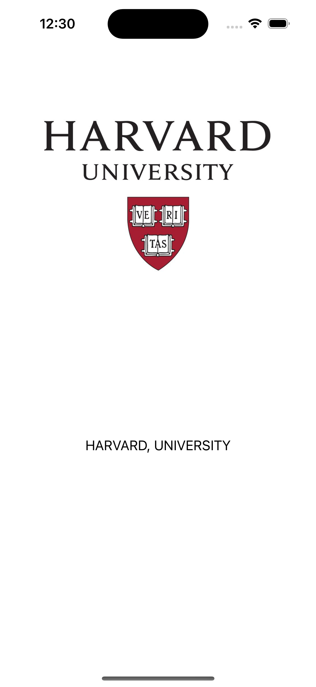
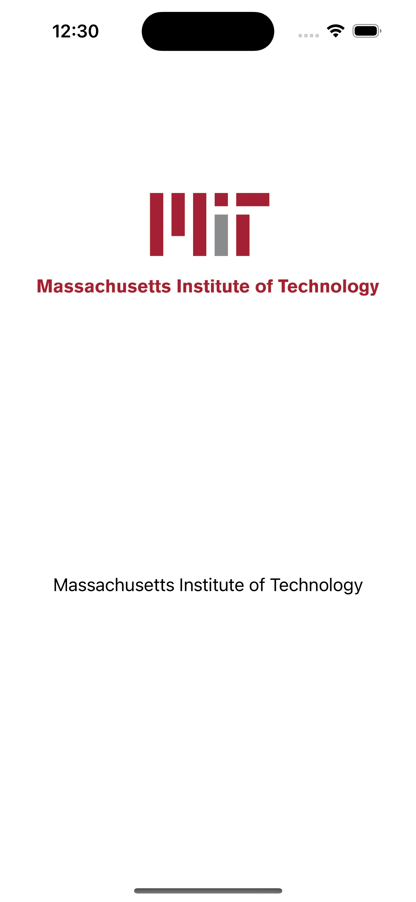
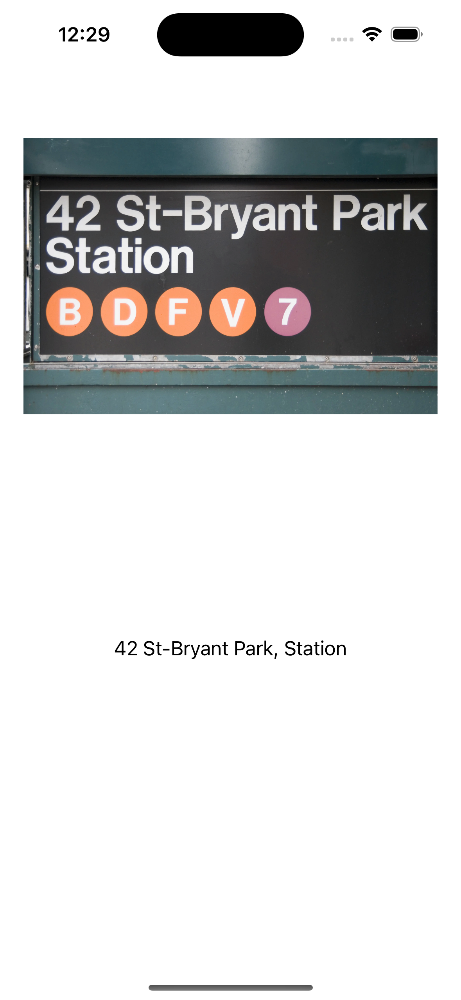
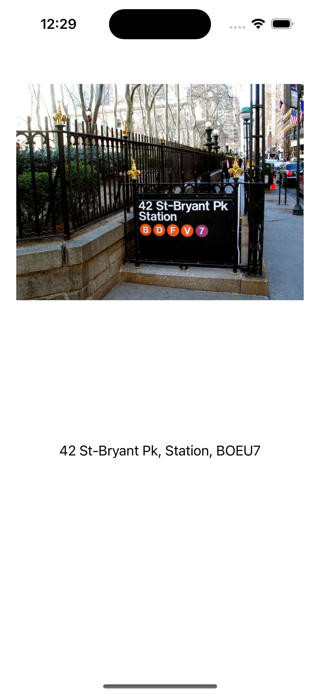
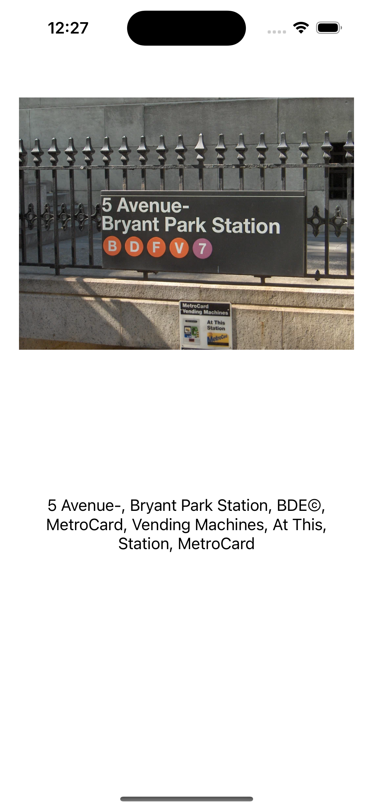
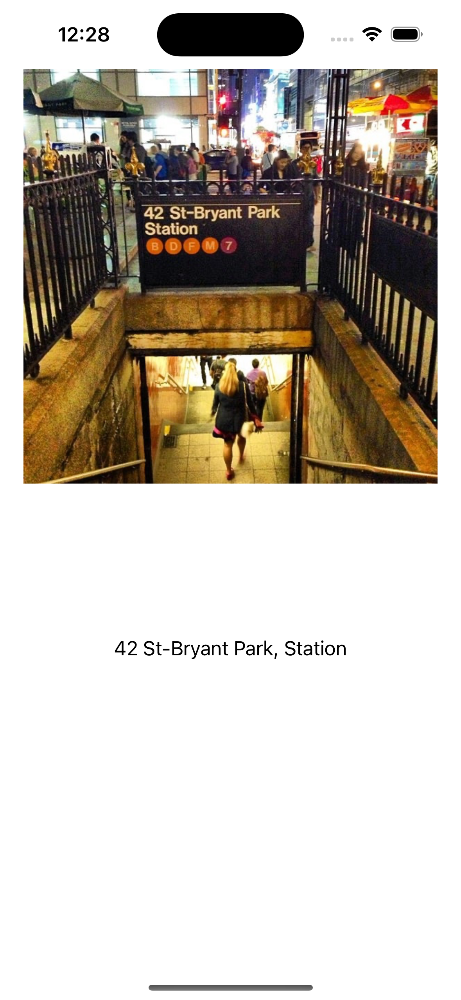
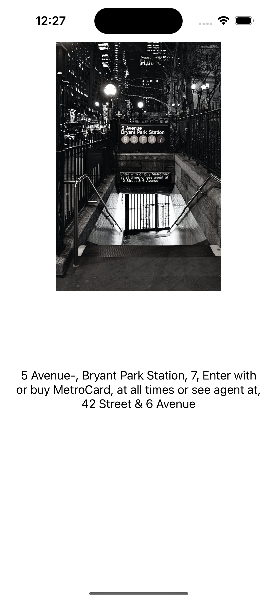
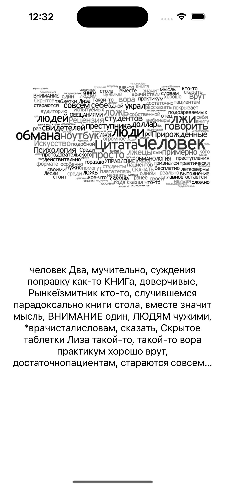

# Text Recognition App

#### Является тестовым примером использования функционала Apple.Vision (Text Recognition by photo)
#### Подробнее https://developer.apple.com/documentation/vision

## Для тестирования использовались следующие данные

## Простой уровень 

### Дорожный знак

### Логотипы ВУЗов
   Harvard University      |      MIT university
:-------------------------:|:-------------------------:
 |  

## Средний уровень (Названия улицы 1-5)

   Street 1                |            Street 2         |                 Street 3    
:-------------------------:|:---------------------------:|:---------------------------:
 |   |   

   Street 4                    |            Street 5
:-----------------------------:|:-------------------------:
 |  

## Много текста (Облако слов)

